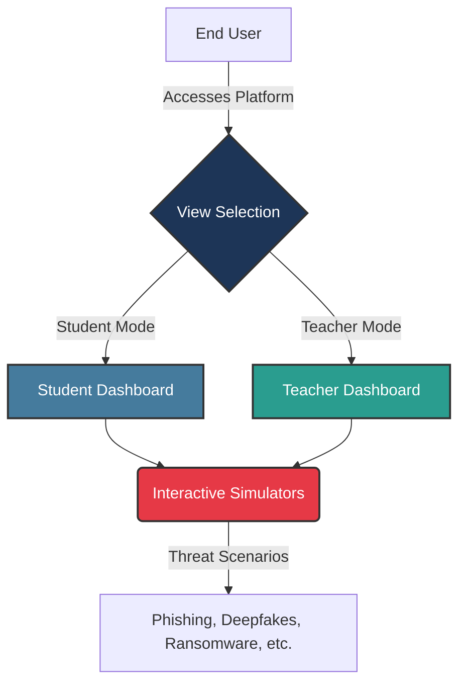

# Cyber Awareness Lab

[](https://reactjs.org/)
[](https://www.typescriptlang.org/)
[](https://vitejs.dev/)
[](https://tailwindcss.com/)
[](https://opensource.org/licenses/MIT)

> **Project Goal:** Make cybersecurity education accessible, engaging, and hands-on by providing interactive threat simulations specifically designed for kids and teenagers (ages 13-18).

## Overview

Nowadays, kids are getting smartphones and computers at a very young age, often without knowing about cyber threats. This leaves them vulnerable to dangers like phishing, social engineering, and malicious downloads. 

I built the **Cyber Awareness Lab** to teach cyber awareness to kids aged 13-18. Reading about a phishing attack is different from seeing one. This platform provides interactive, simulated cyber threats. By participating in scenarios like spotting fake emails, creating secure passwords, or understanding ransomware, students learn how to react in real situations. 

The platform is optimized for landscape devices (like tablets and laptops). It includes a Student Dashboard for learning on their own, and a Teacher Dashboard for classroom presentations.

## Project Architecture

### Visual Flow



The platform contains two main user experiences powered by a shared library of interactive simulations:

1. **Student Dashboard**: 
   - A self-paced learning portal.
   - Users navigate through a curriculum of modules, each containing an introduction, an interactive simulation, detailed explanations, and a knowledge-check quiz.
2. **Teacher Dashboard**: 
   - Designed for classroom environments.
   - Features a "Preparation Mode" for reviewing content and a "Presentation Mode" optimized for big screens and projectors.
3. **Interactive Threat Simulators**: 
   - Core React components that mimic real-world threats (e.g., fake login pages, USB drops, AI deepfakes) safely within the browser.

## Core Features

- **Interactive Threat Simulations**: Safely experience phishing, ransomware, spyware, social engineering, and more.
- **Dual Dashboards**: Dedicated interfaces tailored for both self-paced students and presenting educators.
- **Responsive Design**: Fluid UI that scales perfectly across desktops, tablets, and mobile devices.
- **PWA Support**: Installable as a Progressive Web App (PWA) with offline capabilities.
- **Multilingual Support (i18n)**: Built-in internationalization for broader accessibility.
- **Rich Animations**: Powered by Framer Motion for a premium, engaging user experience.

## Technologies Used

- **Framework**: React 18 + TypeScript
- **Build Tool**: Vite
- **Styling**: Tailwind CSS
- **Animations**: Framer Motion
- **Icons**: Lucide React
- **PWA**: vite-plugin-pwa
- **Internationalization**: react-i18next

## How to Run Locally

### Prerequisites
Make sure you have **Node.js** (v18 or higher) and **npm** installed on your system.

### Setup Steps

1. **Clone the repository:**
   ```bash
   git clone https://github.com/rakesh-pathuri/Cyber-Awareness-Lab.git
   cd Cyber-Awareness-Lab
   ```

2. **Install Dependencies:**
   ```bash
   npm install
   ```

3. **Start the Development Server:**
   ```bash
   npm run dev
   ```

4. **Access the Application:**
   Open your web browser and navigate to **`http://localhost:5173`**.

### Building for Production

To create an optimized production build:
```bash
npm run build
```
You can then preview the build locally using `npm run preview`.

---

### Authorship
**Developed by:** Rakesh Pathuri
*Built to make cybersecurity education interactive, effective, and accessible to everyone.*

